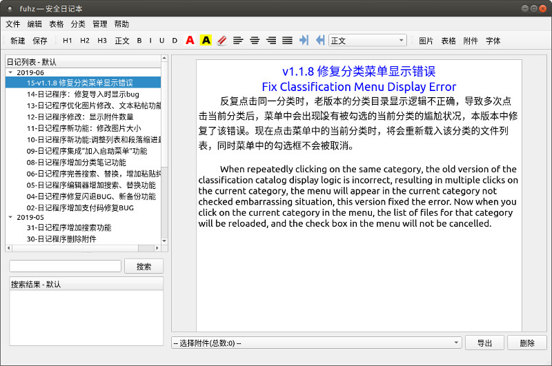

# 安全日记本软件
[ZOL软件下载](http://xiazai.zol.com.cn/detail/48/472109.shtml)

作者联系邮箱： fuhuizn@163.com

### 代码托管页面
- [https://gitee.com/rocket049/secret-diary](https://gitee.com/rocket049/secret-diary)
- [https://github.com/rocket049/secret-diary](https://github.com/rocket049/secret-diary)

# 说明

**适用场合：办公日记、个人日记。**

`secret-diary` (安全日记本)是一个加密日记本，加密强度非常强，只能暴力破解数据，只要密码足够复杂，数据就足够安全。

编辑器也相当完善，支持富文本格式。

兼容 `linux/windows`。

支持语言：中文. 英语

发布协议：Apache 2.0

这是一个开源的写日记软件，非常适合办公场合使用。编辑器相当完善，用QT5开发，使用AES 256加密算法加密，只要你的密码足够复杂，基本不存在数据泄露的隐患。

日记列表的组织方式是按月组织，树形结构，第一级是“年-月”，第二级是“日-标题”，启动时只加载三个月的日记，如果用的时间长了，日记非常多，也不会拖累加载速度。我用一万多条数据模拟连续写30年日记的情况，依然能够秒开。

具有搜索功能。如果日记数量很多，找从前的某个日记是很困难的，可以用关键字搜索日记标题。搜索结果的显示方式也和上面相同，搜索结果用双击的方式打开，会在新的编辑器窗口中显示。

编辑器也相当完善，支持富文本，功能包括：

1. 插入图片，插入时可以设定图片大小，超大图片自动缩小到适合编辑器的尺寸。
2. 导出图片，先选择图片，然后点击右键，选择“导出图片...”。
3. 插入表格，插入. 删除表格行列。用工具栏上的“表格”按钮插入表格，用“表格”菜单修改表格。
4. 删除表格，先选择整个表格，然后按退格键或删除键。
5. 修改文字的颜色和背景色，使用工具栏上的红色“A”，和黄色背景的" A "。
6. 四种对齐方式按钮，使用工具栏中部的四个对其方式按钮。
7. 删除格式，工具栏中部的橡皮擦，有些从外部粘帖的文字包含本编辑器不完全支持的格式，会导致显示异常，可以选择文本后点击该按钮删除格式。
8. 三级标题按钮，工具栏中的“H1. H2. H3”三个按钮，代表三级标题。
9. 多种前缀的列表格式，工具栏中的下拉列表列出了所有支持的列表格式。
10. 修改字体，点击工具栏中的“自体按钮”。
11. 按 TAB 缩进，缩进量为2个汉字的宽度。
12. 多用户，首次打开时需要注册用户，可以使用汉字用户名。
13. 用户名可以修改，从“管理”菜单修改。
14. 密码可以修改，从“管理”菜单修改。
15. 导出. 导入加密日记，从“文件”菜单导入. 导出，导出的文件需要设置密码，以便用户安全的进行网络传输。
16. 导出为PDF文件，从“文件”菜单导出。
17. 插入. 删除附件，用工具栏上的“附件”按钮插入附件，编辑区下方的下拉列表中显示附件，右侧有“导出”. “删除”按钮。
18. 调整段间距。 
19. 格式刷。

### 下载页面

[At github](https://github.com/rocket049/secret-diary/releases)

[码云上的](https://gitee.com/rocket049/secret-diary/releases)

[百度网盘](https://pan.baidu.com/s/14Ltsh1WiuKhHgMA7KgA-dw)，提取码: stdc

### 截图

# 加密算法说明

### 登陆验证算法
`sha256`

哈希值计算过程： 

1. 真实密码 = 用户密码 X 4
2. sha256( 真实密码 )

### 数据加密算法
`AES256`

第一步，数据加密密码，创建用户时从系统读取的32字节随机字符串作为数据加密密码。

第二部，使用用户输入的密码将“数据加密密码”加密后存储在数据库中。

**用于加密“数据加密密码”的密码形成算法：**

1. 用户真实密码 = 用户密码 X 40
2. 真实密码 = sha256( 用户真实密码 )

