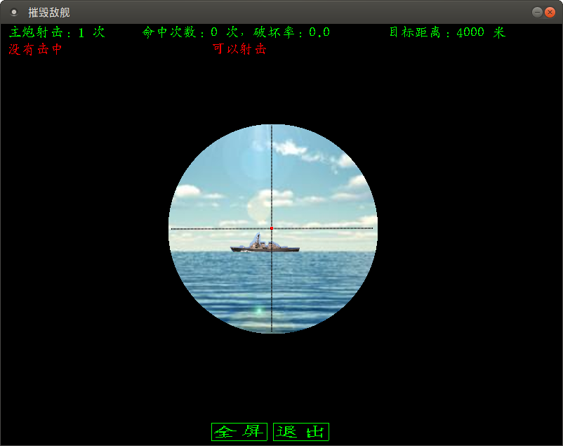
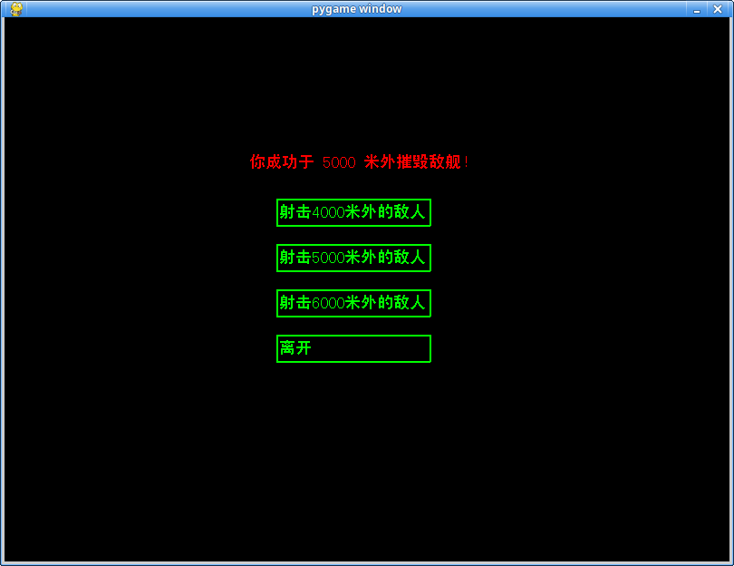

# 海战炮手

## 内容
在摇晃的战舰上用主炮摧毁远处活动的敌方战舰。

## 源代码托管网页
[https://gitee.com/rocket049/ship_gunner](https://gitee.com/rocket049/ship_gunner)

## 测距
- 测距仪等级对应误差级别
- 测距误差 = 误差级别×随机数

## 射击
- 观察镜镜头上下左右晃动，炮长必须抓住射击时机，适时发射，发射时机会引起误差
- 设计误差 = 测据误差 + 发射时机导致误差 + 主炮精准度误差
- 主炮精准度误差：基于主炮等级，每次发射误差 = 主炮等级×随机数

## 设计过程
- 舰长选定目标（自动）
- 测距（自动）
- 炮手调整设计参数
- 射击
- 观察员汇报落点误差
- 炮长调整射击参数
- 再次射击
- 循环上面3步

# 上下晃动

使用 sin 函数计算偏移量，基于时间计算，每 6 秒一个循环。

# 炮击程序设计

- 空格键发射
- 随即播放炮击声音 fire.mp3
- 判断炮击效果，误差 = 击发时机误差 + 随机误差，射程越远，要求越严格
- 延时报告炮击结果，延迟秒数 = 射程 / 1000.0

# 射击界面、战果界面

